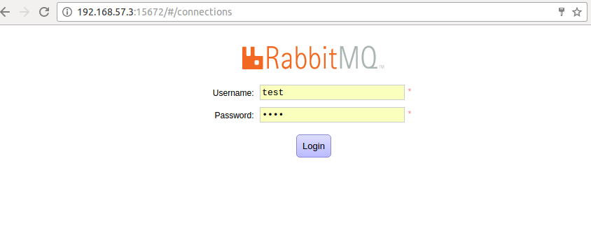
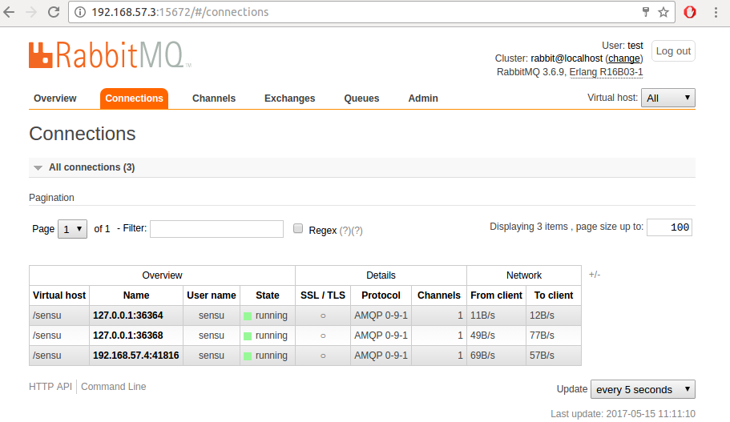
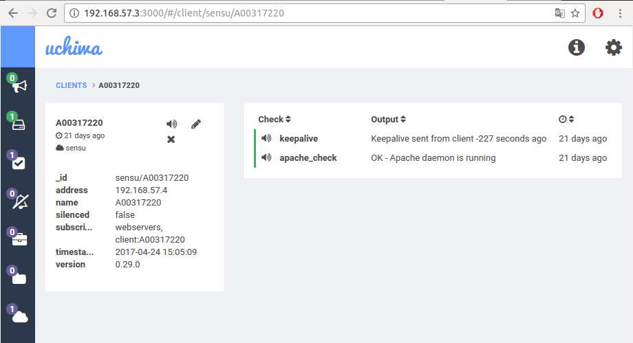
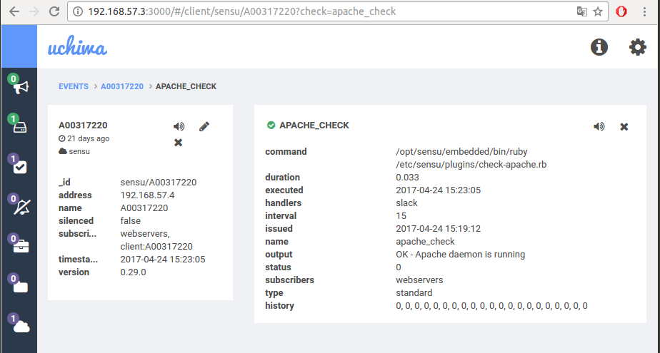
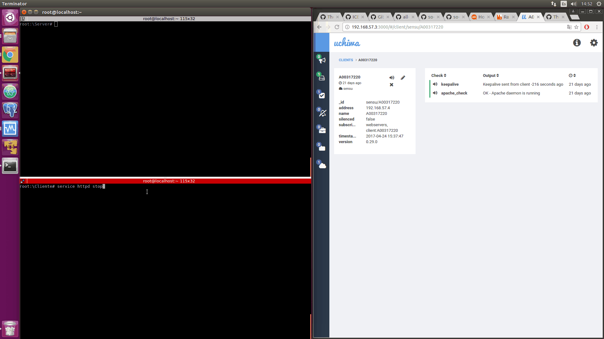
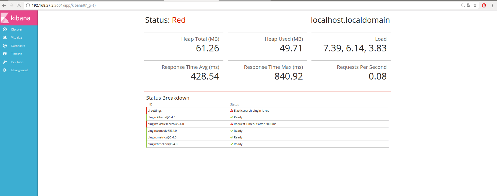
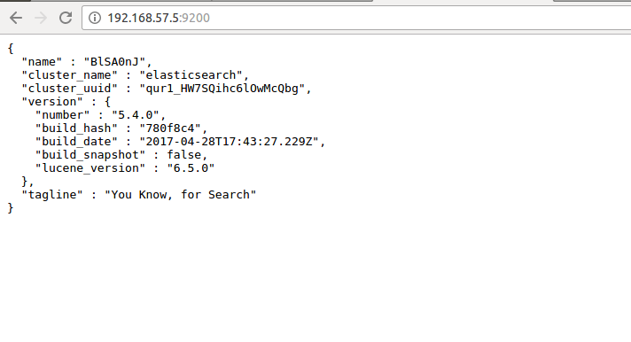

### Parcial 3 sistemas operativos

### Estudiantes: 
**Ray Torres - A00309856**

**URL de github: //www.github.com/RaayTorres/so-exam3**

### Procedimiento

* **Instrucciones para la configuración del cliente**

Para configurar el cliente se realizaron los siguientes pasos:

primero:
``` 
echo '[sensu]
name=sensu
baseurl=https://sensu.global.ssl.fastly.net/yum/$releasever/$basearch/
gpgcheck=0
enabled=1' | sudo tee /etc/yum.repos.d/sensu.repo

```

Luego se instalo sensu mediante los siguientes comandos:

```
yum install sensu -y
sensu-install -p sensu-plugin
```

El servicio del cliente se inicia mediante el siguiente comando:

```
service sensu-client start
```
El servicio de httpd se instalo mediante el siguiente comando

```
yum install httpd -y
```

* Para la parte de la configuración de rabbitmq se hizo lo siguiente 

```
cd /etc/sensu/conf.d
```
Una vez aqui se creo un archivo tipo json (client.json) con la siguiente información

```
{
  "client": {
    "name": "A00317220",
    "address": "192.168.57.4",
    "subscriptions": ["webservers"]
  }
}

```

Luego se creo otro archivo tipo json (rabbitmq.json) con la siguiente información:

```
{
  "rabbitmq": {
    "host": "192.168.57.3",
    "port": 5672,
    "vhost": "/sensu",
    "user": "sensu",
    "password": "password",
    "heartbeat": 10,
    "prefetch": 50
  }
}

```

Finalmente se instalaron algunos plugins para el correcto funcionamiento, para esto lo que se hizo fue:

```
cd /etc/sensu/plugins
```

una vez en esta direccion se creo un archivo ruby (check-apache.rb) con la siguiente información

```
#!/usr/bin/env ruby

procs = `ps aux`
running = false
procs.each_line do |proc|
  running = true if proc.include?('httpd')
end
if running
  puts 'OK - Apache daemon is running'
  exit 0
else
  puts 'WARNING - Apache daemon is NOT running'
  exit 1
end

```

* **Instrucciones para la configuración del servidor**

Lo primero que se hizo para la instalación del servidor fue:


```
echo '[sensu]
name=sensu
baseurl=https://sensu.global.ssl.fastly.net/yum/$releasever/$basearch/
gpgcheck=0
enabled=1' | sudo tee /etc/yum.repos.d/sensu.repo
```

Se realizo la instalación de sensu mediante los siguientes comandos 

```
yum install sensu -y
sensu-install -p sensu-plugin
sensu-install -p sensu-plugins-slack
su -c 'rpm -Uvh http://download.fedoraproject.org/pub/epel/7/x86_64/e/epel-release-7-9.noarch.rpm'
```

Se instalo erlang

```
yum install erlang -y
```

Se instalo redis

```
yum install redis -y
```
Iniciar el servicio redis
```
service redis start
```

Se instalo socat
```
yum install socat -y
```

* Configuración del servicio de rabbitmq

```
su -c 'rpm -Uvh http://www.rabbitmq.com/releases/rabbitmq-server/v3.6.9/rabbitmq-server-3.6.9-1.el7.noarch.rpm'
service rabbitmq-server start
rabbitmqctl add_vhost /sensu
rabbitmqctl add_user sensu password
rabbitmqctl set_permissions -p /sensu sensu ".*" ".*" ".*"
rabbitmq-plugins enable rabbitmq_management
chown -R rabbitmq:rabbitmq /var/lib/rabbitmq

```

A continuación para probar el funcionamiento de rabbitmq se configura un usuario

```
rabbitmqctl add_user test test
rabbitmqctl set_user_tags test administrator
rabbitmqctl set_permissions -p / test ".*" ".*" ".*"

```

* A continuación como fue el proceso de configuración de uchiwa

```
yum install uchiwa -y
```

Para poder utilizar estos servicios es necesario abrir los siguientes puertos:

```
firewall-cmd --zone=public --add-port=5672/tcp --permanent
firewall-cmd --zone=public --add-port=15672/tcp --permanent
firewall-cmd --zone=public --add-port=3000/tcp --permanent
firewall-cmd --reload
```

Finalmente se reinician los servicios

```
service sensu-server restart
service sensu-api restart
service uchiwa restart

```

**A continuación se muestra una prueba del funcionamiento de rabbitmq y de sensu**

* Prueba de funcionamiento de Rabbitmq

* Prueba 1



* Prueba 2



* Prueba de funcionamiento de uchiwa

* Prueba 1


* Prueba 2



A continuación se muestra la generación de una alerta por parte de uchiwa cuanto se detecta la caida de un servicio (ver el gif hasta el final duración aproximada 60 segundos)




## falta punto 5 y 6


**A continuación se muestra los pasos para la configuración y la instalación del stack de ELK**

El primer paso es instalar el openjdk de Java, para esto se utilizo el siguiente comando

```
yum install java-1.8.0-openjdk.x86_64
```
* Elasticsearch

Despues de haber descargado el openjdk se procede a descargar e instalar la llave publica de elasticsearch

```
rpm --import https://artifacts.elastic.co/GPG-KEY-elasticsearch

```

Luego se crea un archivo con el repositorio de elasticsearch, para eso primero ejecutamos el siguiente comando

```
vi /etc/yum.repos.d/elasticsearch.repo
```
Una vez en el editor de texto, se pone la siguiente información


```
[elasticsearch-5.x]
name=Elasticsearch repository for 5.x packages
baseurl=https://artifacts.elastic.co/packages/5.x/yum
gpgcheck=1
gpgkey=https://artifacts.elastic.co/GPG-KEY-elasticsearch
enabled=1
autorefresh=1
type=rpm-md
```

Una vez este listo el repositorio se instala elasticsearch

```
yum install elasticsearch -y
```

* Logstash

Primero se crea un archivo que contenga el repositorio de logstash

```
vi /etc/yum.repos.d/logstash.repo
```

Una vez en el editor se pone la siguiente información

```
[logstash-5.x]
name=Elastic repository for 5.x packages
baseurl=https://artifacts.elastic.co/packages/5.x/yum
gpgcheck=1
gpgkey=https://artifacts.elastic.co/GPG-KEY-elasticsearch
enabled=1
autorefresh=1
type=rpm-md

```

finalmente se instala logstash

```
yum install logstash -y
```

* KIBANA

Primero se crea un archivo que contenga el repositorio de kibana

```
vi /etc/yum.repos.d/kibana.repo
```

Una vez en el editor se pone la siguiente información

```
[kibana-5.x]
name=Kibana repository for 5.x packages
baseurl=https://artifacts.elastic.co/packages/5.x/yum
gpgcheck=1
gpgkey=https://artifacts.elastic.co/GPG-KEY-elasticsearch
enabled=1
autorefresh=1
type=rpm-md
```

finalmente se instala kibana

```
yum install kibana -y
```

* Instalación de filebeat 

Primero se descar e instala la llave publica mediante el siguiente comando

```
sudo rpm --import https://packages.elastic.co/GPG-KEY-elasticsearch
```

Una vez instalada esta llave publica se crea un archivo que contenga el repositorio de filebeat

```
vi /etc/yum.repos.d/elastic.repo
```

En el editor se pone la siguiente información

```
[elastic-5.x]
name=Elastic repository for 5.x packages
baseurl=https://artifacts.elastic.co/packages/5.x/yum
gpgcheck=1
gpgkey=https://artifacts.elastic.co/GPG-KEY-elasticsearch
enabled=1
autorefresh=1
type=rpm-md
```

finalmente se instala filebeat mediante el siguiente comando:

```
sudo yum install filebeat -y
```

* Una vez hecha toda la instalación de elasticsearch, se hizo una prueba de funcionamiento con el ejemplo 0 del gist.github.com/d4n13lbc/be1ad5039dff1c058b335482488d4965


## Ejemplo 0

Para la realización de este ejemplo deben realizarse las siguientes configuraciones:

Primero  se configura el siguiente archivo

```
vi /etc/elasticsearch/elasticsearch.yml
```

Aqui esta parte del archivo debe quedar igual, con la unica diferencia que lo que va a cambiar es la dirección ip

```
# Set the bind address to a specific IP (IPv4 or IPv6):
network.host: 192.168.57.5
# Set a custom port for HTTP:
http.port: 9200
```
Una vez hecha la configuración deben abrirse los puertos

```
firewall-cmd --zone=public --add-port=9200/tcp --permanent
firewall-cmd --reload
```

Luego realizamos la siguiente configuración para kibana

```
vi /etc/kibana/kibana.yml
```

Aqui también lo unico que cambiamos es la dirección ip

```
# Kibana is served by a back end server. This setting specifies the port to use.
server.port: 5601
# To allow connections from remote users, set this parameter to a non-loopback address.
server.host: "192.168.57.5"
# The URL of the Elasticsearch instance to use for all your queries.
elasticsearch.url: "http://192.168.57.5:9200
```

Luego de haber configurado el archivo se abren los puertos

```
firewall-cmd --zone=public --add-port=5601/tcp --permanent
firewall-cmd --reload
```

Finalmente iniciamos los servicios

```
service kibana start
service elasticsearch start
```

* Pruebas de funcionamiento

## Kibana




## Elasticsearch


